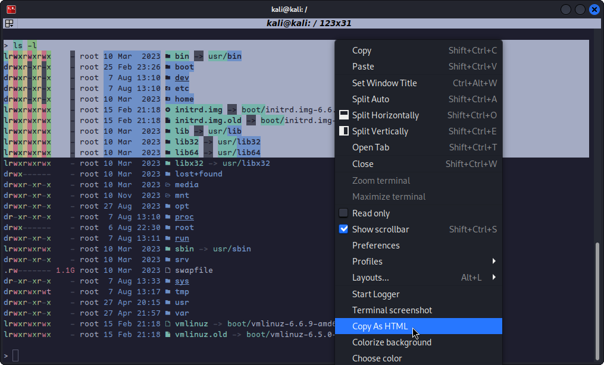
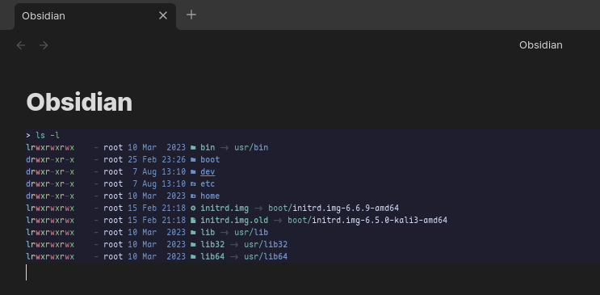

# Terminator-CopyAsHTML
[Terminator](https://github.com/gnome-terminator/terminator) plugin that allows you to copy the selected text as HTML



> While the feature request for Terminator to natively support "Copy As HTML" is being worked (see [Copy as HTML [Feature Request] #754](https://github.com/gnome-terminator/terminator/issues/754)), this plugin can act as a substitute.

# Why would you want selected text from your terminal to be in HTML?
In applications like Obsidian for note taking, the HTML will to rendered so it looks just like a screenshot, but all your text is still there for easy searching.



# Installing the plugin
A plugin can be installed by adding the `copyAsHTML.py` python file in one of two locations:

- `/usr/[local/]share/terminator/terminatorlib/plugins/`
This will need root permissions to do. The optional local/ is usually for packages installed by hand, rather than through the package manager, and this depends on how Terminator was installed on your system.
- `~/.config/terminator/plugins/`
This allows you to use plugins without needing root.

## Installation Walkthrough
1. Download `copyAsHTML.py` and move to the plugin directory
```bash
git clone https://github.com/justin-ball/Terminator-CopyAsHTML.git
cd Terminator-CopyAsHTML
cd copyAsHTML.py ~/.config/terminator/plugins/
chmod +x ~/.config/terminator/plugins/copyAsHTML.py
```
2. Restart and open `Terminator`
2. Right-Click in the Terminator window and click `Preferences`
3. Click on the `Plugins` tab
4. Check `CopyAsHTML`
5. Click `X Close`
6. You should now see the option `Copy as HTML` when you right-click selected text
